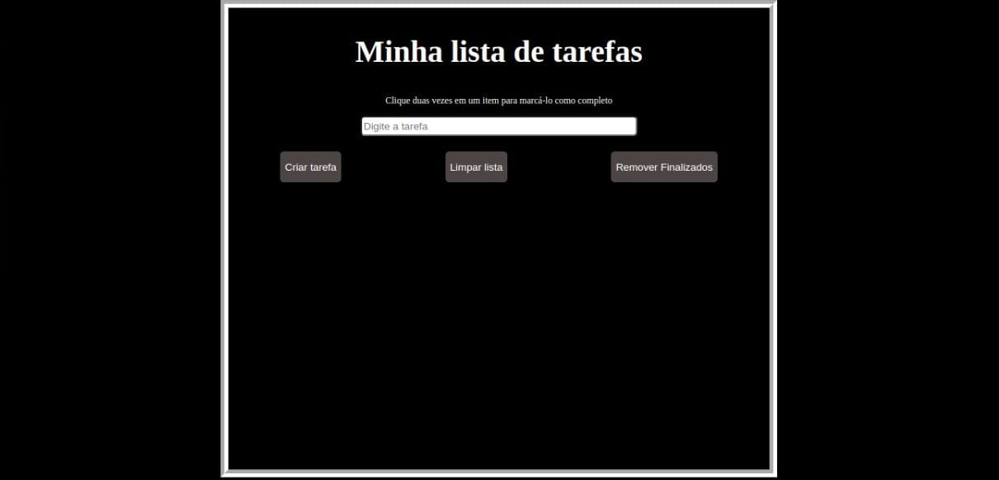
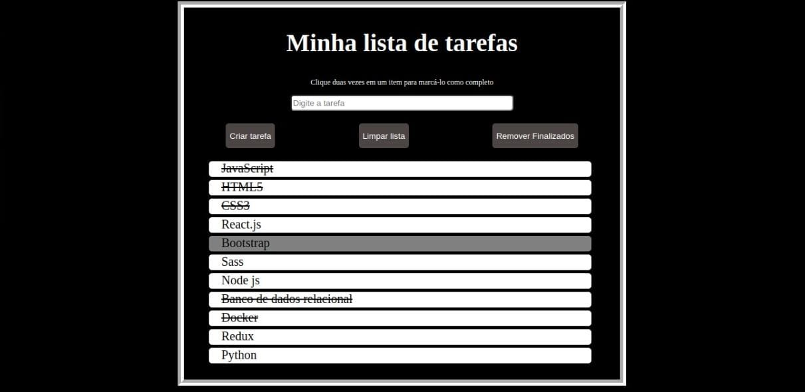

# Projeto To Do List

# Contexto
Este projeto é uma lista de tarefas, onde podemos adicionar tarefas, marcar tarefas concluidas com um simples duplo clique e selecionar item com um único clique.

## Técnologias usadas

Front-end:
> Desenvolvido usando: HTML5, CSS3, JavaScript

## Visualização de aplicação online

> 
